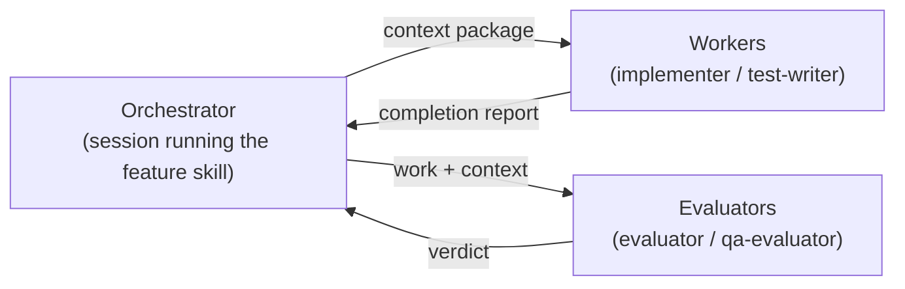
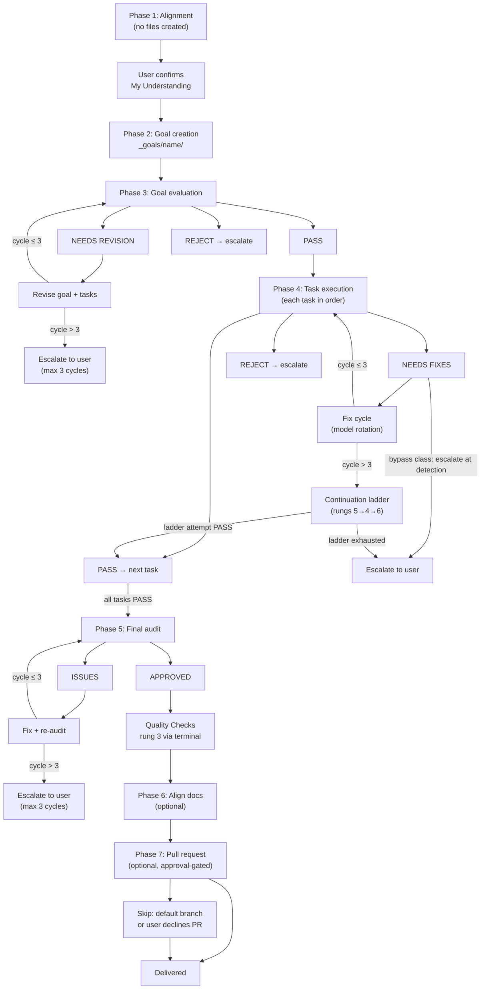
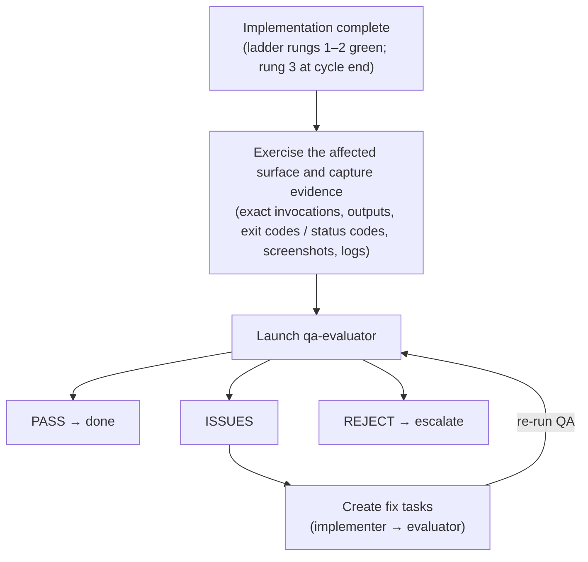

# Cyclotron C# Libraries Orchestration Architecture

A guide to how the feature orchestration system works for **Cyclotron C# Libraries**,
including subagent delegation, evaluation cycles, and retry mechanisms.

> **Stack note:** C# on .NET 10, built with the `dotnet` CLI and MSBuild; NuGet is the
> package manager, under central package management (`Directory.Packages.props` — no
> `PackageReference` anywhere carries a `Version` attribute) with repo-wide build
> properties in `Directory.Build.props` (nullable enabled, `TreatWarningsAsErrors`,
> XML docs generated). The repo is a monorepo of library **families**; today one family,
> `Graph/`, ships two packages — `Cyclotron.Graph.Core` (token providers, the HTTP/auth
> handler stack, subscription CRUD, change-/lifecycle-notification parsing, validation
> and dispatch — resource-agnostic) and `Cyclotron.Graph.Mail` (`IGraphMailClient`,
> mail models, mail-shaped option defaults) — each with an xUnit v3 test project under
> `Graph/tests/`, plus a runnable minimal-API harness at `Graph/samples/`. Every package
> versions independently off its own MinVer tag prefix, and packing runs with
> `-p:UseProjectReferences=false` so a shipped package depends on the *published*
> sibling rather than a locally computed prerelease. The canonical domain reference is
> `Graph/README.md`, which fixes the load-bearing dependency direction: Mail references
> Core, and Core never references Mail or any other resource-specific package.

---

## Table of Contents

1. [Core Concepts](#core-concepts)
2. [Component Overview](#component-overview)
3. [Feature Flow](#feature-flow)
4. [QA Evaluation (Optional Behavioral Gate)](#qa-evaluation-optional-behavioral-gate)
5. [Subagent Communication Protocol](#subagent-communication-protocol)
6. [Evaluation & Retry Mechanisms](#evaluation--retry-mechanisms)
7. [Quick Reference](#quick-reference)

---

## Core Concepts

### Why This Architecture?

Traditional single-agent execution suffers from:

| Problem | Cause | Impact |
|---------|-------|--------|
| **Context Fatigue** | Long conversations exhaust attention | Late tasks get less quality |
| **Sunk Cost Bias** | Agent invested in previous work | Reluctant to reject own output |
| **Optimism Creep** | Desire to "finish" | Cuts corners, skips edge cases |
| **Self-Review Blindness** | Reviewing own work | Misses obvious issues |

### The Solution: Separation of Concerns



| Role | Traits |
|------|--------|
| Orchestrator (coordinates) | Never executes; prepares context; makes decisions; handles retries |
| Workers (execute) | Fresh context; focused task; reports status; checklist-driven |
| Evaluators (verify) | No stake in outcome; defaults to pessimism |

### Key Principle: Fresh Context Per Task

Each subagent invocation:
- Starts with **zero conversation history**
- Receives **only what's in the prompt**
- Returns **one response** to the orchestrator
- Has **no knowledge** of previous attempts or other tasks

This eliminates fatigue and bias completely.

### Subagent Invocation: Retry on Transient Failures

Subagent invocations can fail due to transient issues (network timeouts, rate limits, temporary service unavailability). When this happens:

```
ON subagent invocation failure:
  DO NOT assume "subagent must not exist" or fall back to general agent

  INSTEAD:
  1. Retry the same subagent_type with the same prompt (up to 3 attempts)
  2. Wait briefly between retries (exponential backoff: 2s, 4s, 8s)
  3. Only after 3 failed attempts: escalate to user

  NEVER substitute a different subagent type due to transient errors
```

---

## Component Overview

### Orchestrator & Reference Skills (`.claude/skills/`)

| Skill | Type | Purpose |
|-------|------|---------|
| `feature` | Coordinator | Plans and executes feature implementation across Cyclotron C# Libraries layers |
| `goal-criteria` | Reference | Criteria for goal evaluation |
| `task-criteria` | Reference | Criteria for task evaluation |
| `qa-criteria` | Reference | Criteria for user-facing QA evaluation |
| `test-ladder` | Supporting | New tests → impacted tests mid-cycle; full suites (rung 3) only at cycle end |
| `align-docs` | Coordinator | Phase 6: evaluator-gated sync of all docs to shipped code (docs-only) |
| `ship-pr` | Delivery | Phase 7: draft + create the PR/MR on the project's forge, or hand over (approval-gated) |

This project installs no domain or supporting skills beyond the set above. Domain
ground truth lives in committed docs instead — `Graph/README.md` for the family's
package split and dependency direction, each package's own README for its registration
API and public surface, and the root `README.md` for versioning, packing, and release
mechanics. Route those files into context packages the way a domain skill would be
routed (see Critical Reference Files).

> `goal-criteria`, `task-criteria`, `qa-criteria`, `test-ladder`, `align-docs`, and
> `ship-pr` set `disable-model-invocation: true` — they load via `/name` or a cited
> path, not session-start auto-discovery. `feature` remains auto-invocable.

> The ground-truth docs are this project's knowledge base — the orchestration skills
> above reference them but do not replace them. `test-ladder` is routed into every
> implementation and test context package by `feature` (see its "Supporting skills"
> section).

### Subagents (`.claude/agents/`)

| Subagent | Behavioral Style | Use Case | Model Tier |
|----------|------------------|----------|------------|
| `evaluator` | Skeptical, problem-finding | Goal / task / code verification | frontier, effort high |
| `qa-evaluator` | Skeptical, user-perspective | Behavioral QA of user-facing surfaces | frontier, effort high |
| `implementer` | Focused, checklist-driven | Implementation + fixes | light, effort medium |
| `test-writer` | Coverage-obsessed | Test creation, all external services mocked | light, effort medium |
| `terminal` | Compact command runner | Any Bash or PowerShell command — returns only the result the caller asked for | light, effort medium |
| `diagnostician` | Analytical, diagnosis-only | Root-cause analysis after fix-cycle exhaustion — no code writes | frontier |

The roster is six subagents — `evaluator`, `qa-evaluator`, `implementer`, `test-writer`,
`terminal`, and `diagnostician` — each with a dedicated agent file under `.claude/agents/`.

The orchestrator (and any worker that can spawn) sends `terminal` an exact Bash or
PowerShell command plus the result shape it needs; `terminal` executes it and returns
only that result, so the raw stream never lands in the caller. Rung 3 is always a
`terminal` spawn.

**Model tiers:** The orchestrator (main session) and both evaluators run the **frontier**
tier — delegation and evaluating have a capability floor. The light-tier agents — the
two workers **plus** `terminal` — run the **light** tier — checklist-driven execution
and compact command running keep quality when the plan and verification are strong, at
a fraction of the output-token cost. Model IDs are configuration, not constants: the
resolved per-harness model ID for each tier lives in exactly one place, the model map,
and is pinned into each agent's config from there — on harnesses with a skills tree
(Claude Code, Cursor) the map is also copied to `.claude/skills/setup-models.map.md`
for reference, while the Copilot and Codex emitters place no reference copy of the map,
so their pins live only in the harness's own config/frontmatter (Copilot `.agent.md`
frontmatter, Codex `.codex/agents/<role>.toml`), resolved from the map at setup time;
update the map (and re-pin) when providers rotate names. Harness caveats: on
Copilot a subagent cannot run a stronger model than the session (so the session itself
must run the frontier tier); Cursor silently falls back to a compatible model under
admin/plan restrictions, and does the same — without erroring — when the resolved ID is
unknown or stale (evaluators should report which model produced the verdict).

---

## Feature Flow

### Complete Lifecycle



### Phase notes

**Phase 1 — Alignment (structured discovery).** Stay in Agent Mode and ask structured
questions (5-20 MCQs), with follow-up rounds if needed; then summarize "My
Understanding" and wait for the user to confirm before Phase 2. IMPORTANT: no files
are created during this phase. Discovery covers: problem, affected layer/lane,
external surfaces touched, auth/permissions, behavior/error handling, interface
shape, existing patterns to follow, priority.

**Phase 2 — Goal creation (with decision gates).** Create `_goals/[name]/` and write
`goal.md`. For each task: if multiple viable approaches exist, present them to the
user and WAIT for the decision; only then create the task file. Each task file carries
`## Acceptance Criteria` (criterion + verification method each); the Phase 3 evaluator
validates these once for all tasks.

**Phase 3 — Goal evaluation (mandatory re-evaluate loop).** Launch the evaluator with
the Phase 1 Q&A included (for the Discovery Coverage check). PASS → Phase 4; NEEDS
REVISION → revise the goal + tasks and re-evaluate (3 max); REJECT → escalate to the
user.
INVARIANT: The ONLY exit to Phase 4 is a PASS verdict from the evaluator subagent.
Revisions MUST be re-evaluated.

**Phase 4 — Task execution (mandatory re-evaluate after every fix).** For each task,
in dependency order:

- Step 1: Launch implementer (or test-writer for the test task) — the context
  package includes the task file (including its Acceptance Criteria)
- Step 2: Receive completion report
- Step 3: Launch evaluator
- Step 4: Handle verdict — PASS → next task; NEEDS FIXES → fix cycle (model
  rotation) and re-evaluate, 3 max, then the continuation ladder (rungs 5→4→6 — see
  Evaluation & Retry Mechanisms) before escalation; REJECT → escalate to the user.
  A verdict tagged with a bypass failure class (destructive/security/infra)
  escalates at detection, on any cycle.

INVARIANT: A task is only marked complete after the evaluator returns PASS. There is
no path where fixes are made and the orchestrator proceeds without re-verification.

**Phase 5 — Final audit (mandatory re-audit loop).** All tasks complete → final
evaluator audit. APPROVED → Quality Checks (ladder rung 3: full suites, via a
`terminal` spawn); ISSUES → fix (ladder rungs 1–2), then re-audit (3 max).
INVARIANT: The ONLY exit to Quality Checks is an APPROVED verdict from the audit
subagent. Remediations MUST be re-audited.

**Phase 6 — Align docs (evaluator-gated doc sync, optional).** After Phase 5 Quality
Checks, the orchestrator reads `goal.md`'s `phases:` block — when `align_docs: false`,
skip Phase 6 with an orchestration-log entry ("Phase 6 skipped per goal.md"). When
enabled, Quality Checks green → the align-docs skill: discover the shipped surface →
per-doc edit plan → evaluate the plan → implementer per doc → evaluate each doc →
final doc audit (same re-evaluate invariants and 3-cycle limits as Phases 3–5).
RULES: docs-only (never code), anti-invention (every claim traces to a read file),
`_goals/` is READ-ONLY.

**Phase 7 — Pull request (approval-gated, optional).** After Phase 6 (or its skip),
the orchestrator reads `goal.md`'s `phases:` block — when `pull_request: false`, skip
Phase 7 with an orchestration-log entry ("Phase 7 skipped per goal.md"). When enabled,
docs aligned → the ship-pr skill: analyze branch commits + diff → draft the PR (exec
summary + technical breakdown) → show the draft → USER APPROVES → push (if needed) →
create the PR/MR or hand over → URL. Also skip when the work happened directly on the
default branch or the user declines a PR.
INVARIANT: The PR is never created before the user approves the draft.

### Forge adapter (Phase 7 delivery)

Phase 7 (`ship-pr`) classifies git remotes at invocation time and branches on the forge. **Phase 7 is never deleted from an install** — a repo with no detected forge takes the `none` branch (draft + human hand-over), not a removed phase.

**Taxonomy.** Four values; each names its create mechanism:

| Value | Create mechanism |
|-------|------------------|
| `github` | `gh pr create` |
| `azuredevops` | `az repos pr create` |
| `gitlab` | `glab mr create` |
| `none` | draft + hand-over; never creates |

**Detection.** Classify the chosen remote's URL by domain. Host patterns live only in this table:

| Host pattern | Forge |
|--------------|-------|
| `github.com` | `github` |
| `dev.azure.com`, `ssh.dev.azure.com`, `*.visualstudio.com`, `vs-ssh.visualstudio.com` | `azuredevops` |
| `gitlab.com` | `gitlab` |

The `_git` path segment is the strong signal on Azure DevOps URLs. Anything else classifies to `none` unless overridden. Self-hosted GitLab, GHE (GitHub Enterprise), and on-prem Azure DevOps Server are pattern-undetectable — override-only.

**Remote selection.** Choose the PR-target remote with this procedure:

1. Classify every remote's URL per the taxonomy.
2. A candidate is a remote that classifies to a known forge (`github`, `azuredevops`, `gitlab`). `none`-classified remotes (for example a deploy remote) are NOT candidates and can never trigger disagreement.
3. If candidates span two or more different forges, stop and ask the human — never pick silently.
4. Otherwise pick the PR-target remote by precedence `upstream` → a remote named for its forge (`github`, `azuredevops`/`azure`, `gitlab`) → `origin` → remaining candidates in `git remote` listed order.
5. Zero candidates → the `none` branch unless the manifest override names a forge.

**PR-target remote vs push remote.** Forge classification and base-branch resolution use the chosen PR-target remote. `git push` uses the branch's existing tracking remote if set, else `origin`. A GitHub fork setup (`origin` = fork, `upstream` = parent) keeps pushing to the fork while targeting the parent, exactly as `gh` behaves.

**Override.** In `orchestration-kit.manifest.json`, `options.forge` (one of the four taxonomy values) and optional `options.forgeHost` (self-hosted host mapping) beat detection. The adapter never writes `git config`.

**Base-branch resolution.** Resolve always against the chosen PR-target remote. Name that remote explicitly in every base-resolution command (`ls-remote`/`fetch`/`log`/`diff`) — never a bare hardcoded `origin` in those templates.
Primary resolver: `git ls-remote --symref <remote> HEAD`.
Offline fallback: the cached `refs/remotes/<remote>/HEAD` symref (repair with `git remote set-head <remote> -a`).
On the `github` branch, `gh repo view` remains an accepted resolver.

**Stop and ask** when:

- (a) the chosen remote's HEAD is unresolvable (cached symref unset AND `ls-remote` fails or is auth-blocked);
- (b) two candidate remotes resolve to different forges;
- (c) the resolved base differs from the branch the current commits diverged from.

The human-approval invariant (draft → user approves → create/hand over) holds in all four branches. On-prem Azure DevOps Server is routed to the `none` branch (Microsoft: `az repos` CLI is Services-only).

### Execution Order for Cyclotron C# Libraries

```
SEQUENTIAL: Cyclotron.Graph.Core → Cyclotron.Graph.Mail → Cyclotron.Graph.Sample → packaging metadata (csproj / Directory.Packages.props)
                │
                ▼ (implementation complete)
                │
            Tests (test-writer; ladder rungs 1–2 only)
                │
                ▼ (new + impacted tests pass)
                │
            Final Audit ──► Quality Checks (rung 3: full suites)
                │
                ▼
            Align Docs (Phase 6) ──► Pull Request (Phase 7)
```

Per-task and TDD verification follows the `test-ladder` skill: rung 1 (new
tests) → rung 2 (impacted tests) mid-cycle; rung 3 (every stack's full suite) runs
at cycle end — in the orchestrator's Phase 5 Quality Checks after the audit is APPROVED,
and additionally in a goal's designated closer task when one exists (a Phase 4 worker
gate with a written mandate that never replaces Phase 5).

Use only the layers the feature actually touches — most features reuse shared
infrastructure and add one module plus its interface and tests.

### Evaluation intensity (`eval_depth`)

Every task file's ownership-contract block carries `eval_depth: full` (default) or
`light`. It is orchestrator-set at planning time only — a worker never sets it — and
`light` is never a skip: it shortens the evaluator's rubric to a requirements walk +
targeted tests + write-fence check, while still ending in a real PASS / NEEDS FIXES /
REJECT verdict. The orchestrator assigns `light` only by explicit decision, with a
stated reason recorded in the task file or the goal's Discovery Summary;
`goal-criteria` flags an unexplained `light` and fails a missing field closed to
`full`.

Maintainers periodically compare the verdicts recorded in each goal's
`orchestration-log.md` against what actually happened afterward, then tune the
**criteria skills** — never the evaluator's fixed stance — when its behavior drifts
(see `evaluator.md`'s tuning note). This log-driven ritual is how both `eval_depth`
routing and the evaluation criteria stay calibrated over time.

---

## QA Evaluation (Optional Behavioral Gate)

User-facing QA is a lightweight, optional gate run with the `qa-evaluator` subagent after a feature
is implemented. It covers **all user-facing surfaces**:

- **Public package API** — the only user-facing surface these packages have. It covers
  the DI registration extensions (`AddCyclotronGraphCore`, `AddCyclotronGraphMail`), the
  public contracts (`IGraphMailClient`, `IGraphSubscriptionClient`,
  `IGraphNotificationParser`, `IGraphNotificationValidator`, `IGraphTokenProvider`, and
  the notification sink interfaces), the public models, and options binding plus the
  exact text of `GraphCoreOptionsValidator` / `GraphMailOptionsValidator` failures.
  **Evidence:** a consumer-shaped test — build a real `ServiceCollection` from
  configuration exactly as the package README tells a consumer to, resolve the
  registered contracts, and drive them through `StubHttpMessageHandler`. It must
  exercise the package from outside, the way a downstream repo would, never by reaching
  into internals. Paste the resolved-service assertions and the recorded request URIs,
  methods, and bodies.
- The `Graph/samples/Cyclotron.Graph.Sample` harness is **not** a QA gate: its endpoints
  need real Entra credentials, so it is a manual developer aid, not evidence.



QA never fixes issues — it finds them. Fixes flow back through the standard
implementer + evaluator loop, then QA re-runs.

---

## Subagent Communication Protocol

### Context Package Structure

Every subagent invocation requires a complete context package:

```
┌─────────────────────────────────────────────────────────────────┐
│  SECTION 1: ROLE ASSIGNMENT                                      │
│  "You are the [subagent-name] subagent."                        │
│  "Read: .claude/agents/[subagent-name].md"                  │
├─────────────────────────────────────────────────────────────────┤
│  SECTION 2: TASK DEFINITION                                      │
│  "## Task"                                                       │
│  "[Clear description of what to accomplish]"                    │
├─────────────────────────────────────────────────────────────────┤
│  SECTION 3: INPUT DATA                                          │
│  "## Requirements" (exhaustive list)                            │
│  "## Files to Read" (explicit paths)                            │
│  "## Domain Reference" (domain skill + ground-truth excerpts)   │
├─────────────────────────────────────────────────────────────────┤
│  SECTION 4: CONSTRAINTS                                         │
│  "## Write fence" (the task's writes list)                      │
│  "## Rules" or "## Critical Requirements"                       │
│  - Must do X (e.g. reuse shared core modules)                   │
│  - Must NOT do Y (e.g. re-implement auth, hit live services)    │
├─────────────────────────────────────────────────────────────────┤
│  SECTION 5: OUTPUT FORMAT                                       │
│  "## Output"                                                    │
│  "[Exact structure expected in response]"                       │
└─────────────────────────────────────────────────────────────────┘
```

### Orchestration log (spawn ledger)

Maintain `_goals/[goal-name]/orchestration-log.md` as an append-only spawn ledger.
The log header carries a running `est_tokens` total (sum of per-spawn estimates).

For each subagent spawn:

- **Before launch:** timestamp, agent, model (rotation/fallback), routing reason, task
  `writes` fence, expected outputs, and `context_chars` (character length of the
  context package prompt).
- **After return:** outcome line with `report_chars` (character length of the completion
  report) and `est_tokens` = (`context_chars` + `report_chars`) / 4, labeled estimate
  — proxy fields only; no harness in this kit exposes true token counts.

Ladder transitions, guard trips, and phase skips (e.g. Phase 6/7 declined via
`goal.md`'s `phases:` block) are logged as separate entries. Append-only — rejections
and respawns are new entries, never in-place edits.

---

## Evaluation & Retry Mechanisms

### Continuation ladder (Phase 4 task execution)

When Task Execution (Phase 4) exhausts its 3 implement→evaluate fix cycles, the
orchestrator runs this ladder before terminal human escalation. Apply in this order:

1. **Bypass check (every verdict, every cycle).** A verdict tagged with a bypass failure
   class (`destructive`, `security`, `infra`) stops all retrying immediately — including
   cycles 1–3 — and escalates to the human. Requirement ambiguity routes through rung 5,
   not the bypass — it is not a bypass class.

2. **Rung 5 — arbitration (conditional, checked first on exhaustion).** If cycles 1–3 all
   failed on the *same* required-fix item (unanimous-failure heuristic), spawn the
   evaluator in **arbitration mode** on `claude-fable-5` before any
   further fixing. Outcomes: `criteria-defective` → escalate to the human carrying the
   specific defect; arbiter/primary **disagreement → escalate (never auto-resolve)**;
   `criteria-sound` → continue to rung 4.

3. **Rung 4 — diagnosis-first.** Spawn the `diagnostician` (frontier tier, no code writes)
   with the task file (including its Acceptance Criteria), and all three fix-cycle histories. If its
   hypothesis matches a previously tried fix signature → skip to rung 6 if it recommended
   a split, else escalate. Otherwise run **ONE** diagnosis-driven implementation attempt
   (fresh implementer on `claude-opus-5`, using the diagnostician's rewritten
   required-fixes list) and re-evaluate.

4. **Rung 6 — decomposition + selective retry.** Only on a diagnostician split
   recommendation; the orchestrator derives subtasks with ownership contracts (write sets
   ⊆ the parent task's) from the **failing pieces only** — work earlier cycles
   implemented that the evaluator did not flag stays as-is, is not re-run, and gets no
   separate evaluation. The parent task is complete when every derived subtask has an evaluator PASS. Each subtask gets one implement→evaluate cycle; evaluator spawns never consume the attempt budget — only implementation attempts do.

5. **Terminal.** Human escalation with the full ladder history.

**Failure-class taxonomy (closed set):** `implementation` (default) · `criteria-defect`
· `destructive` · `security` · `infra`. Bypass subset — destructive, security, infra.

**Hard guards:**

- At most **3 additional implementation attempts** after cycle 3, summed across rungs 4
  and 6.
- A **repeated failure signature** stops the ladder immediately.
- Every rung transition is an orchestration-log entry recording agent, model, rung, and
  trigger.
- token/cost budgets are NOT a guard in this kit — no harness exposes token counts
  to markdown policy.

**Attempt accounting:** The diagnosis-driven implementation attempt costs 1 of the 3.
Each rung-6 subtask implement→evaluate cycle costs 1 of the 3. Before splitting, the
orchestrator compares the failing-subtask count against the remaining budget — if the
count exceeds the remaining budget, escalate instead of splitting. **Signature identity:**
the evaluator's required-fixes list as recorded in the orchestration log, identical to an
earlier cycle's list item-for-item after normalizing whitespace and list numbering.

**Deferred future rungs (out of scope):**

- **high-effort pin** — evidence-marginal for routine coding; no procedure defined here.
- **best-of-N** — conflicts with disjoint write-set admission; no procedure defined here.

### Retry Limits by Phase

| Phase | Max Cycles | On Exhaust |
|-------|------------|------------|
| Goal Evaluation (Phase 3) | 3 revise→re-evaluate | Escalate to user |
| Task Execution (Phase 4) | 3 implement→evaluate per task | Continuation ladder (rungs 5→4→6), then escalate to user |
| Final Audit (Phase 5) | 3 fix→re-audit | Escalate to user |
| Align Docs (Phase 6) | 3 per doc + 3 for plan and final doc audit | Escalate to user |
| Pull Request (Phase 7) | n/a — gated on explicit user approval | User edits or declines the draft |
| QA Gate (optional) | bounded by runtime; fixes loop through impl+evaluate | Escalate if unresolved |

### Mandatory Re-Evaluate Invariants

- **Phase 3**: Goal evaluation loop ONLY exits to Phase 4 via a PASS verdict. Revisions without re-evaluate are forbidden.
- **Phase 4**: A task is ONLY marked complete after the evaluator returns PASS. Fixes without re-evaluate are forbidden.
  Fix cycles rotate models — cycle 2 uses a different model family, cycle 3 the frontier tier (see the model map) — and every spawn is recorded in the goal's append-only orchestration log.
- **Phase 5**: Audit loop ONLY exits to Quality Checks via an APPROVED verdict. Remediations without re-audit are forbidden.
- **Phase 6**: A doc is ONLY complete after the evaluator returns PASS; the doc set ONLY ships after the final doc audit returns APPROVED. `_goals/` and code are never touched.
- **Phase 7**: The PR/MR is ONLY created, or the hand-over printed, after the user approves the drafted title and body.

### Escalation Format

```markdown
## Escalation Required

**Phase**: [current phase]
**Issue**: [what went wrong]
**Attempts**: [what was tried]
**Ladder**: [rungs attempted and their outcomes]

**Options**:
1. [option with tradeoffs]
2. [option with tradeoffs]

**What I need from you**: [specific decision or input]
```

For `criteria-defective` escalations (from rung 5 arbitration), state the defective
criterion **verbatim** in the **Issue** line.

---

## Quick Reference

### File Locations

```
.claude/
├── agents/
│   ├── evaluator.md     # Skeptical code/goal/task reviewer
│   ├── qa-evaluator.md              # Skeptical user-facing QA reviewer
│   ├── implementer.md  # Focused implementer
│   ├── test-writer.md           # Test creator (external services mocked)
│   ├── terminal.md              # Bash/PowerShell runner — returns only the asked-for result
│   └── diagnostician.md         # Diagnosis-only (post-cycle-3, no code writes)
│
├── skills/
│   ├── feature/       # Feature coordination
│   │   ├── SKILL.md
│   │   ├── reference/continuation-ladder.md
│   │   └── templates/{goal.md,task.md}
│   │
│   ├── goal-criteria/SKILL.md         # Goal evaluation criteria
│   ├── task-criteria/SKILL.md         # Task evaluation criteria
│   ├── qa-criteria/SKILL.md           # User-facing QA evaluation criteria
│   ├── test-ladder/SKILL.md    # Rungs 1–2 mid-cycle, rung 3 at cycle end
│   ├── align-docs/SKILL.md            # Phase 6: evaluator-gated doc sync
│   └── ship-pr/SKILL.md       # Phase 7: approval-gated PR creation
│
└── ORCHESTRATION.md   # This file

_goals/<goal>/orchestration-log.md  # Append-only spawn ledger per goal
```

### Critical Reference Files

| File | Purpose | When to Include |
|------|---------|-----------------|
| `Graph/README.md` | **Ground truth.** The family's package split and the load-bearing one-way dependency direction (Mail → Core; Core never references Mail), plus which package a consumer installs | Every task touching `Graph/src/**`, and every task that adds a package to a family |
| `Graph/src/<PackageId>/README.md` | That package's registration API, configuration reference, and public surface — the doc that goes stale first when the public API moves | Any task changing that package's public surface, options, or defaults; always in Phase 6 |
| `README.md` (root) | Repo mechanics: family folder convention, independent per-package MinVer versioning, the `UseProjectReferences` build-vs-pack split, CI/release workflows, feed credentials | Any task touching a `.csproj`, `Directory.*.props`, `nuget.config`, or `.github/workflows/**` |
| `Directory.Build.props`, `Directory.Packages.props` | Repo-wide build properties (net10.0, nullable, warnings-as-errors, XML docs) and every centrally pinned package version, including the pinned sibling package | Any task adding or bumping a dependency, changing a build property, or touching versioning |
| `Graph/tests/<PackageId>.Tests/TestSupport/` | `StubHttpMessageHandler` and `RecordingSinks` — the hand-written fakes that stand in for Microsoft Graph. This repo declares **no** mocking library on purpose | Every test task, and any implementation task that changes an HTTP call shape |
| `.claude/skills/test-ladder/SKILL.md` | Which test rung runs when | Every implementation and test task |
| `.claude/skills/setup-models.map.md` | Resolved model ID per tier | Any task that re-pins or rotates models |

### Quality Checks

| Step | Command |
|------|---------|
| Tests (rung 3 — full suites, cycle end only) | `dotnet test CyclotronAzure.Libraries.sln` |
| Lint / format | `dotnet format CyclotronAzure.Libraries.sln --verify-no-changes` (severities come from the repo's shared `.editorconfig`) |
| Type check | `dotnet build CyclotronAzure.Libraries.sln` — C# has no separate type checker. `TreatWarningsAsErrors` and `GenerateDocumentationFile` are on repo-wide, so a build failure is also the correctness-lint and missing-XML-doc gate |

CI (`.github/workflows/ci.yml`) runs `dotnet restore` → `dotnet build -c Release` →
`dotnet test -c Release` against the solution on `ubuntu-latest` only, and runs **no**
format check — so `dotnet format --verify-no-changes` is a local gate that CI will not
catch for you.

Don't invent commands for tools that aren't configured. Tests must mock all external
service/network access. Do not run rung 3 during Phase 4 tasks or TDD loops — except
in a goal's designated closer task when its task file mandates the full-suite run as
the closing gate — the `test-ladder` skill governs which rung runs when. Rung 3 is executed by **spawning
`terminal`** with the command above, never by the orchestrator running it in this
session.

### Common Commands

**Setup:**
```bash
dotnet restore CyclotronAzure.Libraries.sln
```

**Tests** (staged ladder — see `test-ladder`):
```bash
dotnet test Graph/tests/Cyclotron.Graph.Core.Tests/Cyclotron.Graph.Core.Tests.csproj --filter "FullyQualifiedName~GraphNotificationValidator"     # rungs 1–2, during Phase 4 / TDD loops
dotnet test CyclotronAzure.Libraries.sln         # rung 3 — cycle end only
```

### Invoking Skills

```
/feature            - Start a new feature implementation (Phases 1–7)
/align-docs         - Phase 6 standalone: sync docs to shipped code
/ship-pr    - Phase 7 standalone: draft + create the PR/MR on the project's forge, or hand over
/test-ladder - Test-rung rules (also routed into every impl/test task)
```

The criteria skills (`goal-criteria`, `task-criteria`, `qa-criteria`) are reference checklists used by the
evaluator subagents — they are not invoked directly.

### Subagent Behaviors

| Subagent | Default Stance | Key Behavior | Auto-Fail Triggers |
|----------|----------------|--------------|-------------------|
| `evaluator` | Score starts at 2/5 | Actively looks for code problems | A `<Version>` element in a csproj or a `Version=` attribute on a `PackageReference`; `Cyclotron.Graph.Core` referencing `Cyclotron.Graph.Mail` or any resource-specific package; a mocking library added instead of extending `StubHttpMessageHandler`; a warning suppressed (`#pragma warning disable`, `<NoWarn>`, `TreatWarningsAsErrors=false`) to make the build green; a test that reaches the real Graph or Entra endpoints; a tenant id, client id, secret, or PAT written into a tracked file; a new public member with no XML doc comment |
| `qa-evaluator` | Score starts at 2/5 | User-perspective behavioral QA | Public surface changed while the package README's registration or configuration reference still documents the old shape; a new option with no validator coverage and no failure message; a breaking change to an already-published API with no note on the version lineage; a DI registration that no consumer-shaped test actually resolves; an options-validation failure whose message does not name the setting that is wrong; a Graph error surfaced to the consumer as a bare `HttpRequestException` with the status code lost |
| `implementer` | Must complete ALL | Checklist-driven execution | Skipping requirements |
| `test-writer` | 100% coverage required | Outcome-verifying tests | Functions without tests, live external-service calls |


### Workflow State Tracking

The orchestrator maintains this state throughout execution:

```markdown
## Orchestration Progress: [Goal Name]

### Phase 1: Alignment (structured discovery — no files created)
- [ ] Discovery questions asked
- [ ] Follow-up questions asked (if needed)
- [ ] Summary presented to user
- [ ] User confirmed understanding ("yes, proceed")

### Phase 2: Goal Creation
- [ ] Goal.md created
- [ ] Decision gates passed (or user decided)
- [ ] Task files created

### Phase 3: Goal Evaluation (must loop until PASS)
- [ ] Evaluator subagent invoked (attempt 1)
- [ ] Verdict: [PASS/NEEDS REVISION/REJECT]
- [ ] Final verdict that allowed progression: PASS

### Phase 4: Execution (each task must loop evaluator until PASS)
| Task | Cycle 1 | Cycle 2 | Cycle 3 | Final Verdict |
|------|---------|---------|---------|---------------|
| 01-... | ⬜ | - | - | ⬜ |
| 02-... | ⬜ | - | - | ⬜ |

### Phase 5: Final Audit (must loop until APPROVED)
- [ ] Audit subagent invoked (attempt 1)
- [ ] Verdict: [APPROVED/ISSUES FOUND]
- [ ] Final verdict that allowed progression: APPROVED
- [ ] Quality checks (ladder rung 3: full suites) passed

### Phase 6: Align Docs (must loop until doc audit APPROVED)
- [ ] Change surface + per-doc edit list built
- [ ] Edit plan evaluated PASS
- [ ] Each doc executed + evaluated PASS
- [ ] Final doc audit APPROVED (docs only; _goals/ untouched)

### Phase 7: Pull Request (gated on user approval)
- [ ] PR title + body drafted from branch commits
- [ ] User approved the draft
- [ ] PR/MR created/updated on the project's forge, or hand-over printed — URL or artifact: [link]
See ### Forge adapter (Phase 7 delivery).
```

---

## Summary

1. **Orchestrators coordinate, never execute** - They prepare context and make decisions
2. **Subagents execute with fresh context** - No fatigue, no bias
3. **Evaluation is always separate** - Pessimistic evaluators review all work (code AND behavior)
4. **Re-evaluate is mandatory** - Fixes/revisions MUST be re-verified by an evaluator subagent
5. **Retries have limits (3 cycles)** - Phase 4 task execution continues through the continuation ladder (rungs 5→4→6) before escalation; other phases escalate after 3 cycles
6. **Escalation is explicit** - User gets clear options and required decisions
7. **The Iron Law is enforced** - Tests define behavior, implementation must conform
8. **Shared core is reused** - New modules build on shared infrastructure; never re-implement auth/transport/plumbing
9. **Tests never touch live services** - All external/network access is mocked
10. **Staged test ladder** - New tests, then impacted tests; full suites only after all cycle changes are applied
11. **Docs ship with the code** - Phase 6 aligns every doc to shipped behavior (docs-only, evaluator-gated) before the work is done
12. **Delivery is a PR/MR on the project's forge, or a hand-over, approved by a human** - Phase 7 drafts from the branch's commits; it is never created or handed over without user approval
